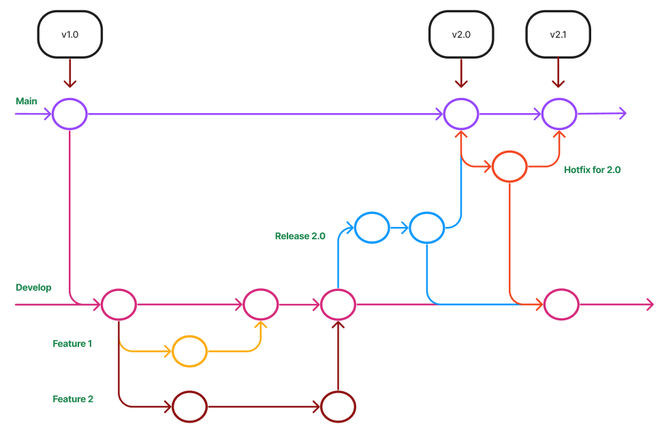

# Git Workflow

This document describes a clean, practical Git workflow suitable for small to medium teams. It is inspired by Git Flow and trunk-based development, with a focus on clarity and safety.

---

## Branching Strategy

### Main Branches

* **`main`**

  * Always production-ready
  * Protected branch (changes only via Pull Request)
  * Every commit should be deployable

* **`develop`** (optional)

  * Integration branch for ongoing development
  * Used if your team prefers staging before production



---

## Supporting Branches

### Feature Branches

* Naming: `feature/<short-description>`
* Created from: `main` or `develop`
* Merged back via Pull Request

Example:

```bash
git checkout -b feature/user-auth
```

### Bugfix Branches

* Naming: `bugfix/<short-description>`
* Created from: `main` or `develop`
* Used for non‑critical bugs

### Hotfix Branches

* Naming: `hotfix/<short-description>`
* Created from: `main`
* Used for critical production issues

---

## Commit Guidelines

Write commit messages in the **present tense**, as if describing what the commit does right now.

**Format:**

```
<type>: <short summary>
```

**Rules:**

* Use present tense ("add", not "added")
* Be concise and descriptive
* Avoid vague messages like "update" or "fix stuff"

**Common types:**

* `feat` – add a new feature
* `fix` – fix a bug
* `docs` – update documentation
* `refactor` – refactor code
* `test` – add or update tests
* `chore` – maintain tooling or dependencies

**Examples:**

```
feat: add JWT authentication
fix: handle null user session
refactor: simplify payment validation
```

---

## Pull Request Workflow

1. Create a branch from `main` (or `develop`)
2. Make focused commits
3. Push the branch
4. Open a Pull Request
5. Request review
6. Fix feedback
7. Merge using **Squash** 

---

## Code Review Rules

* No self‑merging
* At least one approval required
* CI must pass before merge
* Keep PRs small and focused

---

## Release Process

### Using `develop`

* Merge `develop` → `main` for releases
* Tag releases on `main`

```bash
git tag v1.2.0
git push origin v1.2.0
```

---

## Versioning

Follow **Semantic Versioning**:

```
MAJOR.MINOR.PATCH
```

* MAJOR – breaking changes
* MINOR – new features
* PATCH – bug fixes

---

## Best Practices

* Pull before you push
* Rebase feature branches frequently
* Delete branches after merge
* Avoid long‑lived feature branches
* Keep commits atomic

---

## Example Workflow

```bash
git checkout main
git pull origin main
git checkout -b feature/payment-api
# work & commit
git push origin feature/payment-api
# open PR → review → merge
```

---

## Notes

Adapt this workflow to your team size and release frequency. Consistency matters more than complexity.

Happy committing 🚀
